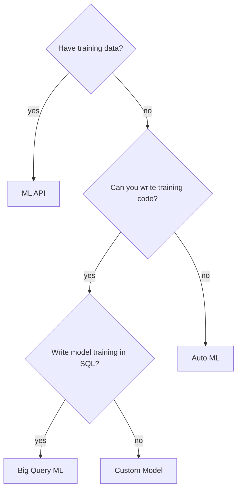

# Vertex AI

### With Machine Learning Service to use 

```mermaid
flowchart TD
    training_data{"Have training data?"}
    training_data -->|yes| ML_API["ML API"]
    training_data -->|no| write_training_code{"Can you write training code?"}
    write_training_code -->|yes| write_model_sql{"Write model training in SQL?"}
    write_training_code -->|no| auto_ml["Auto ML"]
    write_model_sql -->|yes| bigquery_ml["Big Query ML"]
    write_model_sql -->|no| custom_model["Custom Model"]
```

## References

